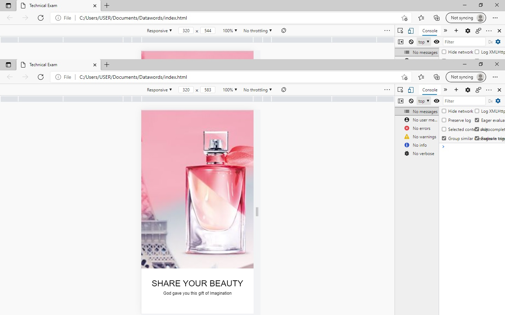
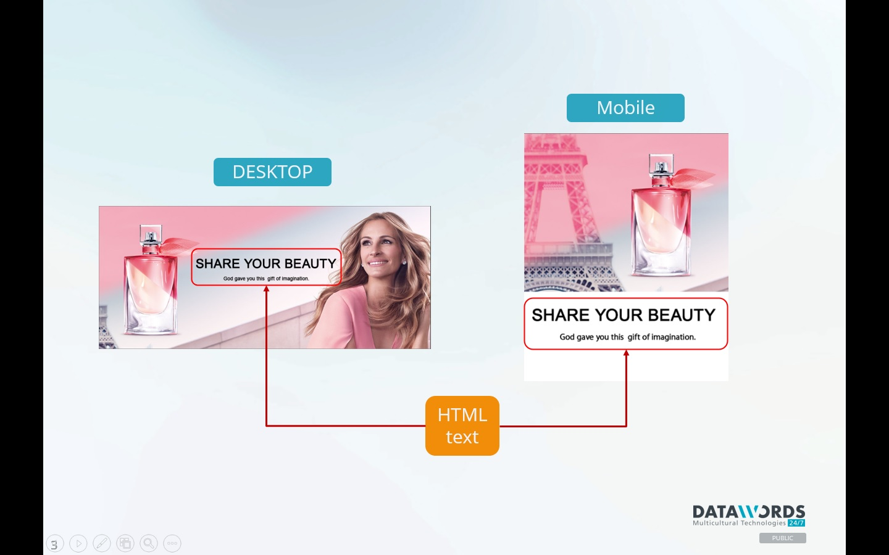

# Digital Specialist Technical Exam

- To produce a single static web page given the PSD of the proposed design. The main requirement is to recreate the expected Landing page with two different layouts on large screen and small screen devices.

## Exam Details

- Time Instruction Received: May 12, 6:10 PM
- Time Started: 8:19 PM
- Time Finished: 10:45 PM
- Time Alloted until: May 13, 6:10 PM

## Screenshots

 
 

## Design Requirement

